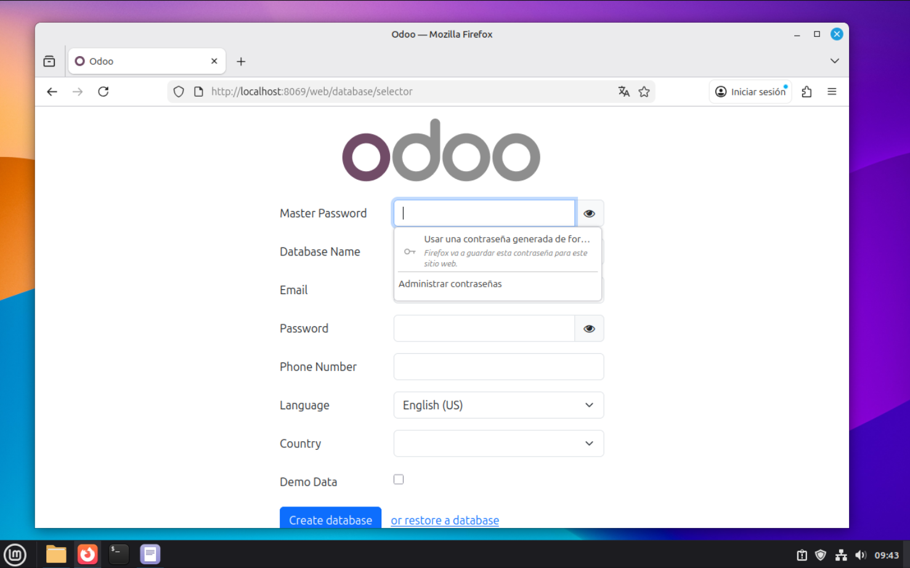

# Odoo-easy-installer   


## Antes de usar  ⚠️
Por el momento solo he probado este instalador en VM con Linux Mint 22.2, para un uso educativo. Para usos en entornos no educativos es más que recomendable revisar las variables al inicio del script y cambiar contraseñas tras la instalación.  
## ¿Para qué sirve este repositorio? ⁉️
Si alguna vez te has enfrentado a instalar Odoo por primera vez, sabrás lo frustrante que puede llegar a ser. Pero hay que tratar de convertir esos retos en posibilidades.  
Este repositorio simplifica y acorta enormemente el proceso de instalación de Odoo. De hecho se instala en poco más de 3 minutos.  
## Instalación  :gear:
Clona este repositorio:  
```
git clone https://github.com/HectorCRM/Odoo-esay-installer.git
```
Dale permiso de ejecución al archivo ***instalador_odoo.sh***:  
```
chmod +x instalador_odoo.sh
```
Ejecútalo:  
```
./instalador_odoo.sh
```
Ahora sólo ve siguiendo los pasos indicados en la terminal.  
**#1.** El instalador comprobará la conexión a internet lanzando un ping a github.com.  
**#2.** Preguntará que versión de Odoo clonar(**ej: 18.0**).  
**#3.** Después pedirá que el usuario introduzca y confirme una contraseña para **PostgreSQL**(se instalará automaticamente más tarde).  
Entre esta interacción y la siguiente el instalador hara:  
 - Actualizará los repositorios del sistema y creará un archivo de texto temporal con todos los que estan instalados antes de instalar nada para Odoo, esto permitirá(en un futuro) hacer una desinstalación limpia.  
 - Instalará todas las dependencias necesarias para el funcionamiento de Odoo.  
 - Creará el usuario odoo en el sistema junto con su directorio.  
 - Creará el usuario y contraseña para odoo en PostgreSQL.  
 - Clonará la versión de Odoo elegida por el usuario en el directorio personal del usuario odoo.  
 - Creará, si no existe, el directorio para custom-addons.  
 - Creará un entorno virtual con python3-venv e instalará en el los paquetes del **requirements.txt**.   
 
**#4.** Pasado un "breve" periodo de tiempo instalando paquetes, el instalador solicitará al usuario que introduzca y confirme una contraseña de acceso a Odoo.  
**#5.** Configura los archivos odoo.conf y odoo.service.  
**#6.** Comprueba si el puerto 8069 está libre, de no estarlo se pregunta al usuario si quiere seguir con la instalación. En caso afirmativo se le recomienda modificar el puerto de Odoo en el archivo /etc/odoo.conf, en caso negativo se interrumpe la instalación.  
En futuras mejoras daré opcion a modificar el puerto desde el mismo instalador.  
**#7.** Recarga el demonio e inicia el servicio de Odoo.  
**#8.** Crea un archivo de texto temporal con los paquetes instalados en el sistema tras instalar Odoo. Ordena el archivo que se creo antes de iniciar la instalación y el que se acaba de crear y los compara, guardando sólo los que se han instalado durante la instalación de Odoo en un nuevo archivo, el cual en un futuro permitirá hacer una desinstalación limpia.  
**#9.** Finaliza la instalación y genera un informe final, con la fecha y la hora en la que se realizó, y los diferentes usuarios y contraseñas.  
Elimina de la memoria todas las variables y borra los archivos temporales.  
  
Y al fin, tras poco mas de 3 minutos...  


## Desinstalación :construction:
En desarrollo.  
## Requisitos :clipboard:
 - Linux Mint 22+/Ubuntu 24+  
 - Conexión a internet  
## Mejoras futuras :rocket:
 - Desarrollar desinstalador(En proceso).  
 - Opción para custom-addons/puerto personalizados desde terminal.  
 - Alternativa preconfigurada para instalación desatendida.  
## Test :heavy_check_mark:
Actualmente probado con Linux Mint 22.2 en máquina virtual.  
