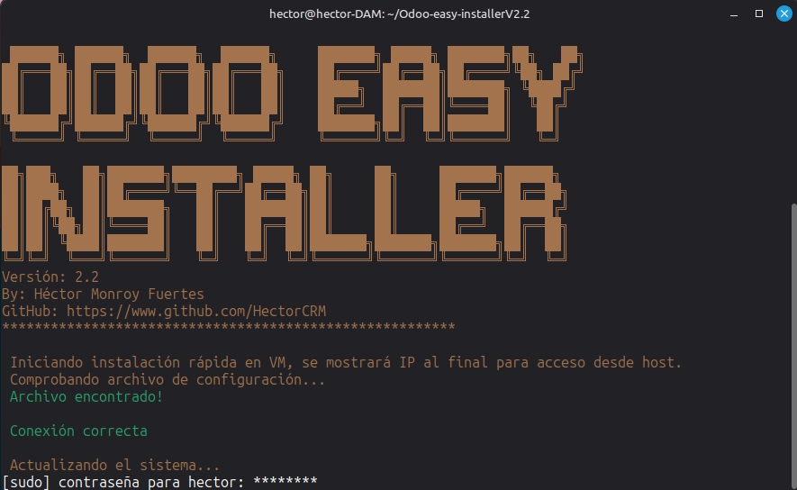
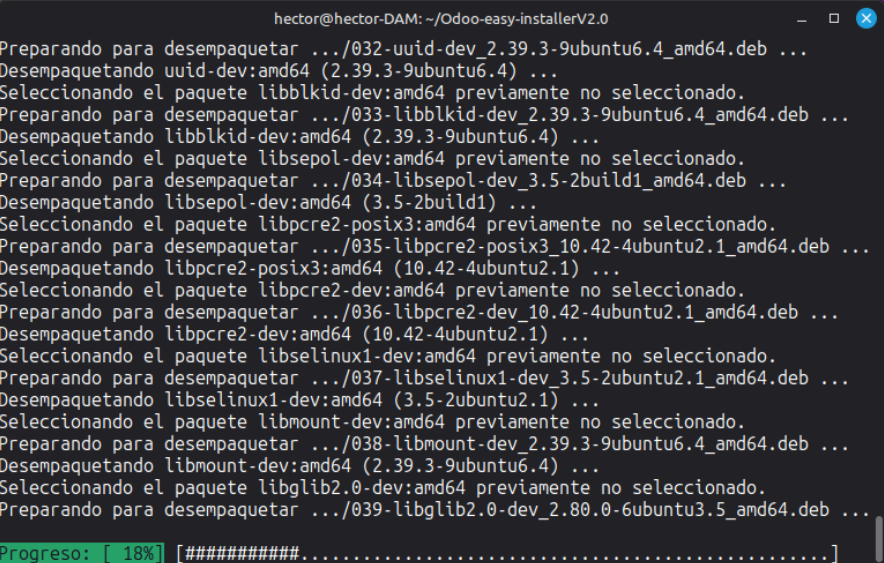
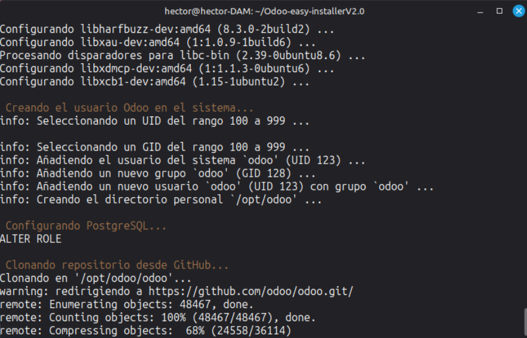
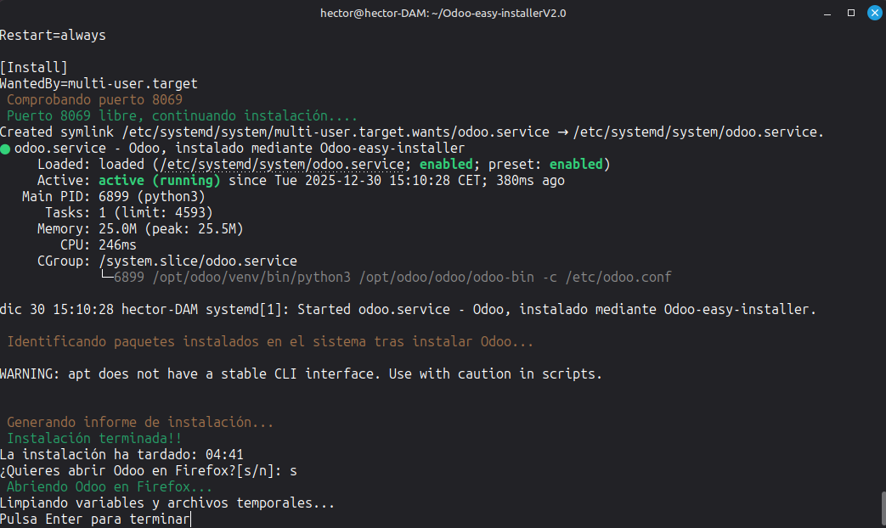
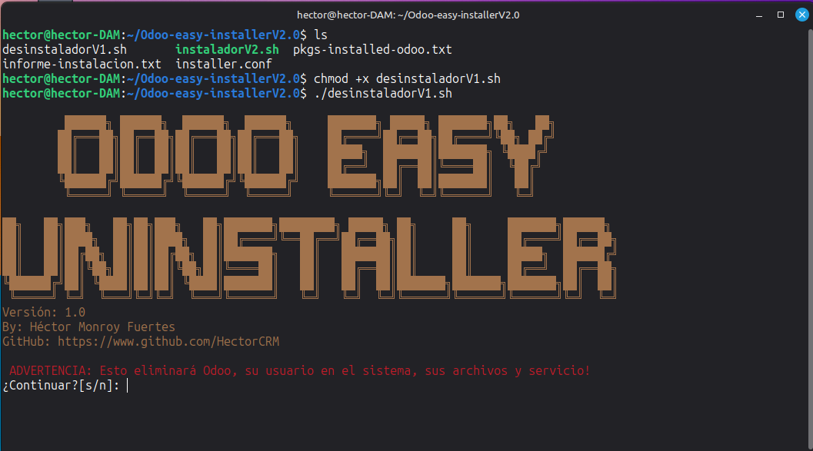
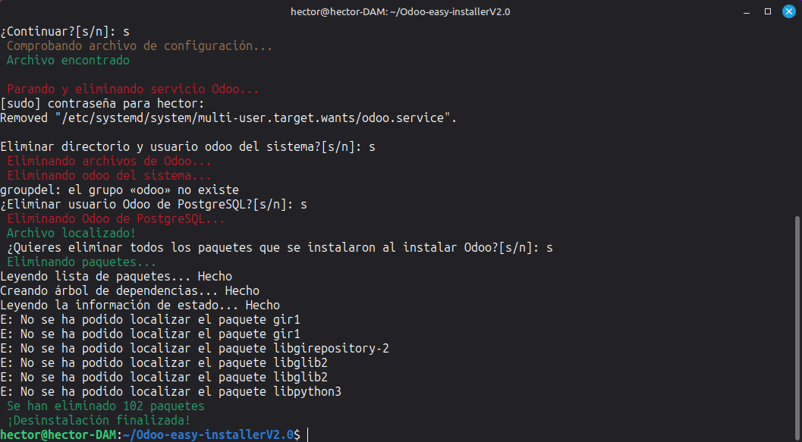

# Odoo-easy-installer   


## Antes de usar  ⚠️
Por el momento sólo he probado este instalador en VM con Linux Mint 22.2, para un uso educativo.  
Para usos en entornos no educativos es más que recomendable eliminar contraseñas del archivo **installer.conf** si se configura para una instalación rápida, asi como del archivo **informe-instalacion.html** o cambiarlas tras la instalación.  
## ¿Cual es la utilidad de este proyecto? ⁉️
Si alguna vez te has enfrentado a instalar Odoo por primera vez, sabrás lo frustrante que puede llegar a ser. Pero hay que tratar de convertir retos en posibilidades.  
Así nace este proyecto, de la frustración de tratar de instalar el ERP de Odoo sin exito. Decidí coger esa frustración y crear un proyecto que pueda ser de utilidad a los demás.  
Este proyecto simplifica y acorta enormemente el proceso de instalación de Odoo. De hecho **se instala en poco menos de 5 minutos(1 minuto menos con la bandera -x).**  
## ¿Que hay de nuevo en esta V2.2? :bulb:
En esta versión se ha implementado el uso de banderas en el script:  
 - **--help**: Muestra un resumen de las banderas disponibles para ejecutar el instalador.  
 - **--version**: Muestra la version del instalador.  
 - **-x o --express**: Permite ejecutar el instalador sin interacción con el usuario y sin sleeps, ahorrando 1 minuto de media en la instalación segun las pruebas que he podido hacer.  
 - **-x--help**: Ofrece información de como emplear la bandera **-x o --express**.  
 - **-vm**: Indica al instalador que Odoo va a ser instalado en una máquina virtual, por lo que al finalizar la instalación mostrará la IP de la VM para poder acceder a Odoo desde la máquina host.  
  
Es posible ejecutar el instalador con las banderas -x y -vm a la vez:  
```
./instalador.sh -x -vm  
```
  

## Instalación  :gear:
Clona este repositorio:  
```
git clone https://github.com/HectorCRM/Odoo-esay-installer.git
```
Dale permiso de ejecución al archivo ***instalador.sh***:  
```
chmod +x instalador.sh
```
Ejecútalo, usando banderas de forma opcional:  
```
./instalador.sh
```
  
Ahora sólo ve siguiendo los pasos indicados en la terminal.  
**#1.** El instalador comprobará la conexión a internet lanzando un ping a github.com.  
**#2.** Preguntará que versión de Odoo clonar(**ej: 18.0**).  
**#3.** Después pedirá que el usuario introduzca y confirme una contraseña para **PostgreSQL**(se instalará automaticamente más tarde).  
Entre esta interacción y la siguiente el instalador hara:  
 - Actualizará los repositorios del sistema y creará un archivo de texto temporal con todos los que estan instalados antes de instalar nada para Odoo, esto permitirá(en un futuro) hacer una desinstalación limpia.  
  
 - Instalará todas las dependencias necesarias para el funcionamiento de Odoo.  
 - Creará el usuario odoo en el sistema junto con su directorio.  
 - Creará el usuario y contraseña para odoo en PostgreSQL.  
 - Clonará la versión de Odoo elegida por el usuario en el directorio personal del usuario odoo.  
  
 - Creará, si no existe, el directorio para custom-addons.  
 - Creará un entorno virtual con python3-venv e instalará en el los paquetes del **requirements.txt**.   
 
**#4.** Pasado un "breve" periodo de tiempo instalando paquetes, el instalador solicitará al usuario que introduzca y confirme una contraseña de acceso a Odoo.  
**#5.** Configura los archivos odoo.conf y odoo.service.  
**#6.** Comprueba si el puerto 8069 está libre, de no estarlo se pregunta al usuario si quiere seguir con la instalación. En caso afirmativo se le recomienda modificar el puerto de Odoo en el archivo /etc/odoo.conf, en caso negativo se interrumpe la instalación.  
En futuras mejoras daré opcion a modificar el puerto desde el mismo instalador.  
**#7.** Recarga el demonio e inicia el servicio de Odoo.  
**#8.** Crea un archivo de texto temporal con los paquetes instalados en el sistema tras instalar Odoo. Ordena el archivo que se creo antes de iniciar la instalación y el que se acaba de crear y los compara, guardando sólo los que se han instalado durante la instalación de Odoo en un nuevo archivo, el cual en un futuro permitirá hacer una desinstalación limpia.  
**#9.** Finaliza la instalación y genera un [informe](./docs/informe-instalacion.html) final, con la fecha y la hora en la que se realizó, y los diferentes usuarios y contraseñas.  
Elimina de la memoria todas las variables y borra los archivos temporales.  
  
  
Y al fin, tras algo menos de 5 minutos...  
  

## Desinstalación :gear:
Para una desinstalación completa es necesario que el archivo **pkgs-installed-odoo.txt** este presente en la misma carpeta, ya que en el se guarda el nombre de todos los paquetes instalados al instalar Odoo en el sistema. **Sin el estos paquetes no podrán ser eliminados**.  
Para desinstalar Odoo primero hay que dar permiso de ejecución al archivo **desinstaladorV1.sh**:  
```
chmod +x desinstaladorV1.sh
```
Después, ejeútalo:  
```
./instaladorV1.sh
```
  
Ahora solo tienes que ir confirmando las acciones ya que estas son destructivas(sólo con Odoo).  
**#1.** Pedirá confirmación para prodecer con la desinstalación, en caso afirmativo buscará el archivo **installer.conf** para saber qué tiene que eliminar.  
**#2.** Detendrá y eliminara el servicio de Odoo en el sistema.  
**#3.** Pedirá confirmación para eliminar el usuario creado para Odoo en el sistema junto con su directorio.  
**#4.** Pedirá confirmación para eliminar el usuario creado en PostgreSQL para Odoo.  
**#5.** Buscara el archivo **pkgs-installed-odoo.txt** y pedirá confirmación para eliminar del sistema todos los paquetes que figuran en él.



## Requisitos :clipboard:
 - Linux Mint 22+/Ubuntu 24+  
 - Git  
 - Conexión a internet  
## Mejoras futuras :rocket:
 - Desarrollar desinstalador. :heavy_check_mark:  
 - Opción para custom-addons/puerto personalizados en installer.conf. :heavy_check_mark:  
 - Implementar el uso de banderas. :heavy_check_mark:  
 - Probar en Ubuntu 24+.  
 - Probar en Debian.  
## Test :heavy_check_mark:
Actualmente probado con Linux Mint 22.2 en máquina virtual.  
## Versiones :pushpin:
[Ver CHANGELOG.md](./CHANGELOG.md)
